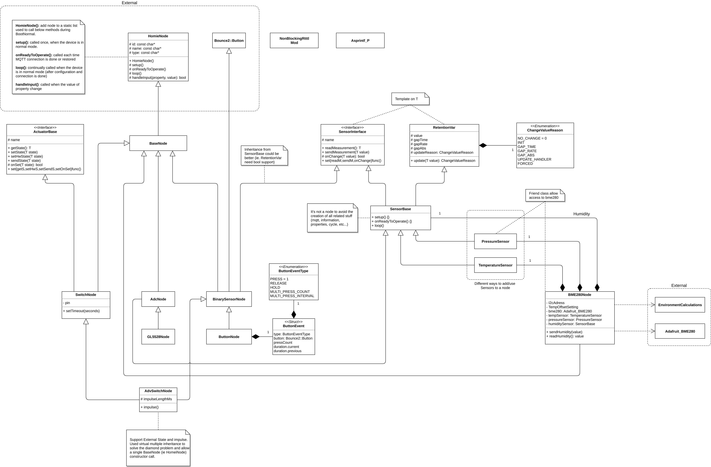

[![Issues][issues-shield]][issues-url]
[![MIT License][license-shield]][license-url]
[![Homie][homie-shield]][homie-url]
[![LinkedIn][linkedin-shield]][linkedin-url]

<p align="center">
<h1 align="center">YAHNC</h1>
<h3 align="center">Yet Another Homie Node Collection</h3>

  <p align="center">
    Libs utility framework to build your <a href="https://github.com/homieiot/homie-esp8266">Homie</a> nodes
  </p>
</p>
<br />

## About The Project

YAHNC libs is born (and maybe will dead) as University project. It can be used as development base (ie utility/framework) on which build new **sensors** and/or **actuator** following the amazing [Homie for ESP8266/ESP32][homie-url] philosophy.

## Getting Started

YAHNC can be used with [PlatformIO](https://platformio.org/).

### Installation

1. Add this repository to your `lib_deps` in `platformio.ini`:

```ini
lib_deps = https://github.com/elbowz/yahnc.git#master, ...
```

2. include the libraries you need in your code:

```c++
#include <BME280Node.hpp>
#include <SwitchNode.hpp>
#include <BinarySensorNode.hpp>
#include <ButtonNode.hpp>
```

## Usage

There is no documentation at this time. So you can view:

* the commented examples
* the class diagram 
* and of course the `src` folder.

### Examples

Some didactic examples to better understand how to use it:

* [THUMBL-P](https://github.com/elbowz/thumbl-p) - Temperature HUmidity Motion Buzzer Light - Pressure *(full device)*
* [SWECS](https://github.com/elbowz/swecs) - Switch External Control & State *(full device)*
* [BME280Node](/src/BME280Node.hpp) - Sensor node class for the [BME280](https://www.bosch-sensortec.com/products/environmental-sensors/humidity-sensors-bme280/). Describe 3 different ways to aggregate multiple sensors in a node. *(used in THUMBL-P)*

### Class Diagram



## License

Distributed under the MIT License. See [LICENSE][license-url] for more information.

## Credits

* [Homie for ESP8266 / ESP32](https://github.com/homieiot/homie-esp8266)
* [Homie Node Collection](https://github.com/luebbe/homie-node-collection)
* [Adafruit BME280 Library](https://github.com/adafruit/Adafruit_BME280_Library)
* [BME280](https://github.com/finitespace/BME280/blob/master/src/EnvironmentCalculations.h) - Heat index calculation


[issues-shield]: https://img.shields.io/github/issues/elbowz/yahnc.svg?style=for-the-badge
[issues-url]: https://github.com/elbowz/yahnc/issues
[license-shield]: https://img.shields.io/github/license/elbowz/yahnc.svg?style=for-the-badge
[license-url]: /LICENSE.txt
[linkedin-shield]: https://img.shields.io/badge/-LinkedIn-black.svg?style=for-the-badge&logo=linkedin&colorB=555
[linkedin-url]: https://www.linkedin.com/in/emanuele-palombo/
[homie-shield]: https://img.shields.io/static/v1?label=Powered&message=Homie&style=for-the-badge&color=informational
[homie-url]: https://github.com/homieiot/homie-esp8266